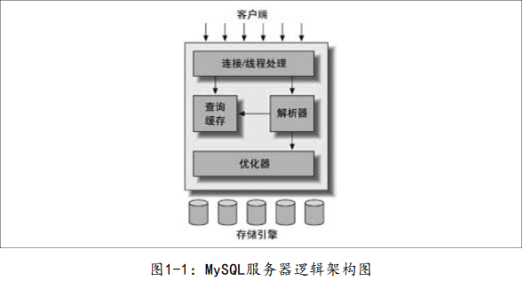
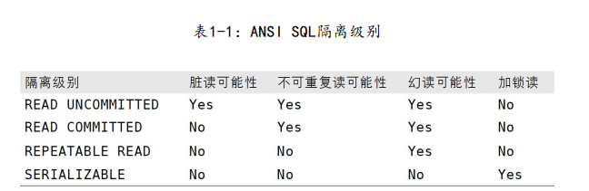

# Mysql

## 1.mysql架构与历史

### 1.1.逻辑架构

- 
- 第一层客户端服务架构类似于大多数基于网络的客户端/服务器的工具。负责连接处理、授权认证、安全等。
- 大多数Mysql的核心服务都在第二层，负责查询解析、分析、优化、缓存以及所有的内置函数（日期、时间、数学和加密函数等），所有的跨存储引擎的功能都在这一层实现：存储过程、触发器、视图等。
- 第三层存储引擎负责Mysql中的数据的存储和提取。
- 每个客户端都会在服务器进程中拥有一个线程，这个连接的查询只会在这个单独的线程中执行，该线程只能轮流在某个CPU核心或者Cpu中运行。服务器会负责缓存线程，因此不需要为每一个新建的连接创建或者销毁线程（线程池）

### 1.2.并发控制

#### 1.2.1.读写锁

- 在处理并发读或写时，可以通过实现一个由两种类型的锁组成的锁系统来解决问题。这两种类型的锁通常被称为共享锁（shared lock）和排他锁（exclusive lock），也叫读锁（read lock）和写锁（write lock）
  - 读锁是共享的，或者说是相互不阻塞的。多个客户在同一时刻可以同时读取同一资源而互不干扰
  - 写锁是排他的，写锁会阻塞其他的写锁和读锁

#### 1.2.2.锁粒度

- 任何时候，在给定的资源上，锁定的数据量越少，则系统的并发程度越高
- 锁策略：在锁的开销和数据的安全性之间寻求平衡，大多数的商用数据库系统一般都是在表上施加行级锁，并以各种复杂的方式来实现，以便在锁比较多的情况下尽可能的提供更好的性能
- 每种Mysql的存储引擎都可以实现自己的锁策略和锁粒度
  - 表锁：Mysql最基本的策略，并其实开销最小的策略。会锁定整张表。进行写操作前，需要先获得写锁，会阻塞其他用户对该表的所有读写操作。开销小，并发程度低
  - 行锁：最大程度地支持并发处理。行锁只在存储引擎层实现

### 1.3.事务

- 原子性(atomicity)：一个事务必须被视为一个不可分割地最小工作单元，整个事务中地所有操作要么全部提交成功，要么全部失败回滚，对于一个事务来说，不可能只执行其中的一部分操作
- 一致性(consistency)：数据库总是从一个一致性状态转换到另一个一致性状态
- 隔离性(isolation)：一个事务所做的修改在最终提交之前，对于其他事务是不可见的
- 持久性(durability)：一旦事务提交，则所做的修改就会永久存在数据库中

#### 1.3.1.隔离级别

- READ UNCOMMITTED（未提交读、读未提交）：事务中的修改，即使没有提交，对其他事务也都是可见的。事务可以读取未提交的数据，这也被称为脏读。
- READ COMMITTED（提交读、不可重复读）：一个事务开始时，只能“看见”已经提交的事务所做的修改，也就是说，一个事务从开始直到提交之前，所做的任何修改，对于其他事务都是不可见的。大多数数据库系统的默认隔离级别都是READ COMMITTE（但Mysql）不是。这个级别也叫不可重复读（因为两次相同的查询得到的结果可能是不一样的）
- REPEATEABLE READ（可重复读）：该级别理论上保证了在同一个事务中多次读取同样记录的结果是一致的。但是理论上，可重复读隔离级别无法解决幻读问题：当某个事物在读取某个范围内的记录时，另一个事务又在该范围内插入了新的记录，当之前的事务再次读取该范围内的记录时，会产生幻行。可重复读是Mysql默认的事务隔离级别
- SERIALIZABLE（可串行化）：最高的隔离级别，它通过强制事务串行执行，避免了幻读问题。它会在读取的每一行数据上都加上锁，比较耗费资源
- 

#### 1.3.2.死锁

- 两个或多个事务同时在同一资源上相互占用，并请求锁定对方所占用的资源，从而导致恶性循环的现象称为死锁。当多个事务试图以不同顺序锁定资源或多个事务同时锁定统一资源时就可能会会产生死锁
- 为解决死锁问题，数据库实现了各种死锁检测机制和死锁超时机制
- 死锁发生以后，只有部分或者完全回滚其中一个事务，才能打破死锁

#### 1.3.3.事务日志

- 使用事务日志，存储引擎在修改表的数据时只需要修改其内存拷贝，再把该修改行为记录到持久在硬盘上的事务日志中，而不用每次都将修改的数据本身持久到磁盘。如果数据的修改已经记录到事务日志并持久化，但数据本身还没有写回磁盘，此时系统崩溃，存储引擎在重启时能够自动恢复这部分修改的数据。具体的恢复方式则视存储引擎而定

#### 1.3.4.mysql中的事务

- 自动提交（auto commit）：Mysql默认自动采用自动提交模式。如果不是显式地开始一个事务，则每个查询都被当作一个事务执行提交操作

- ```mysql
  SHOW VARIABLES LIKE 'AUTOCOMMIT';  #查看自动提交是否开启，ON和OFF
  SET AUTOCOMMIT = 1; #开启自动提交
  ```

- 有一些命令，在执行之前会强制执行COMMIT提交当前事务的活动，例如数据库定义语言（DDL）

- 当混用存储引擎时，如果某些存储引擎不支持回滚，那么当回滚时只能回滚支持回滚的存储引擎中的数据

- 隐式和显式锁定：InnoDB采用的时两阶段锁定协议。在事务执行过程中，随时都可以执行锁定，锁只有在执行COMMIT或者ROLLBACK的时候才会释放，并且所有的锁都是在同一时刻被释放，这个过程为隐式锁定；也可以通过以下命令进行隐式锁定：

  - ```mysql
    SELECT ... LOCK IN SHARE MODE;
    SELECT ... FOR UPDATE
    ```

- InnoDB引擎没有必要进行显式加锁，因为它会自动进行隐式加锁，并且性能更好

### 1.4.多版本并发控制

- 多版本并发控制（MVCC）的实现，是通过保存数据在某个时间点的快照来实现的，也就是说，不管需要执行多长时间，每个事务看到的数据都是一致的。根据事务开始的时间不同，每个事务对同一张表，同一时刻看到的数据可能是不一样的。
- 不同存储引擎对于MVCC的实现是不一样的，分为乐观MVCC并发控制和悲观MVCC并发控制
- InnoDB的MVCC，是通过在每行记录后面保存两个隐藏的列来实现的。这两个列，一个保存了行的创建时间，一个保存行的过期时间（或删除时间）。当然存储的并不是实际的时间值，而是系统版本号 （system version number）。每开始一个新的事务，系统版本号都会自动递增。事务开始时刻的系统版本号会作为事务的版本号，用来和查询到的每行记录的版本号进行比较

### 1.5.Mysql存储引擎

#### 1.5.1.InnoDB

- InnoDB是Mysql的默认事务型引擎，也是最重要、使用最广泛的存储引擎。它被设计用来处理大量的短期（short-lived）事务，短期事务大部分情况是正常提交的，很少会被回滚。InnoDB的性能和自动崩溃恢复特性，使得它在非事务型存储的需求中也很流行
- 采用MVCC来支持高并发，实现了四个标准的隔离级别，默认是REPEATABLE READ，并且通过间隙锁策略防止幻读的出现，间隙锁使得InnoDB不仅仅锁定查询涉及的行，还会对索引中的间隙进行锁定，以防止幻影行的插入
- InnoDB表是基于聚簇索引建立的，聚簇索引对主键查询有很高的性能。不过它的二级索引（secondary index，非主键索引）中必须包含主键列，所以如果主键列很大的话， 其他的所有索引都会很大
- InnoDB内部做了很多优化，包括从磁盘读取数据时采用的可预测性预读，能够自动在内存中创建hash索引以加速读操作的自适应哈希索引（adaptive hash index），以及能够加速插入操作的插入缓冲区（insert buffer）等

#### 1.5.2.MyISAM

- Mysql5.1及之前的版本的默认存储引擎。支持全文索引、压缩、空间函数等特性，但不支持行锁和事务
- MyISAM对整张表加锁，读取时加共享锁，写入时加排他锁。但是在表有读取查询时可以向其中插入新的记录

#### 1.5.3.其他存储引擎

- Archive：只支持INSERT和SELECT操作，Mysql5.1之前不支持索引。会缓存所有的写并利用zlib对插入的行进行压缩。但是每次SELECT都会进行全表扫描。适合日志和数据采集类的应用
- Blackhole：没有实现任何存储机制，会丢弃所有插入的数据，不做任何保存。但是服务器会记录Blackhole的日志，所以可以用于复制数据到备库，或者只是简单地记录到日志
- Federated：是访问其他Mysql服务器的一个代理，他会创建一个到远程Mysql服务器的客户端连接，并将查询传输到远程服务器执行，并提取或发送需要的数据，默认是禁用的
- Memory：适合快速地访问不会被修改的数据，它的所有数据都保存在内存中，不需要进行磁盘IO，但是它的所有数据在重启后会丢失，表结构会保留
- Merge：MyISAM引擎的变种，它是由多个MyISAM表合并而来的虚拟表
- NDB：集群引擎，作为SQL和NDB原生协议之间的接口

#### 1.5.4.转换表的引擎

- ```mysql
  ALTER TABLE [choose_table_name] ENGINE=INNODB;
  ```

- 如果转换表的存储引擎，将会失去和原引擎相关的所有特性。例如，如果将一张InnoDB表转换为MyISAM，然后再转换回InnoDB，原InnoDB表上所有的外键将丢失

- 可以使用mysqldump工具将数据导出到文件，然后修改文件中的CREATE TABLE语句的存储引擎选项

- 也可以创建一张新表，将原数据复制到新表中，sql如下：

  - ```mysql
    #数据量较小
    CREATE TABLE [new_table_name] LIKE [old_table_name];
    ALTER TABLE [new_table_name] ENGINE=INNODB;
    INSERT INTO [new_table_name] SELECT * FROM [old_table_name];
    #数据量较大
    START TRANSACTION;
    INSERT INTO [new_table_name] SELECT * FROM [old_table_name] WHERE id BETWEEN x AND y; #重复调整x和y的值
    COMMIT;
    ```


## 2.基准测试

- 基准测试是唯一方便有效的、可以学习系统在给定的工作负载下会发生什么的方法
- 基准测试可以观察系统在不同压力下的行为，评估系统的容量，掌握哪些是重要的变化，或者观察系统如何处理不同的数据。基准测试可以在系统实际负载之外创造 一些虚构场景进行测试
- 基准测试有两种主要的策略：一是针对整个系统的整体测试，另外是单独测试MySQL
- 测试的指标：
  - 吞吐量：单位时间内的事务处理数
  - 响应时间或者延迟：用于测试任务所需的整体时间
  - 并发性：并发性基准测试需要关注的是正在工作中的并发操作，或者是同时工作中的线程数或者连接数
  - 可扩展性：简单地说，可扩展性指的是，给系统增加一倍的工作，在理想情况下就能获得两倍的结果（即吞吐量增加一倍）。或者说，给系统增加一倍的资源 （比如两倍的CPU数），就可以获得两倍的吞吐量。当然，同时性能（响应时间）也必须在可以接受的范围内。大多数系统是无法做到如此理想的线性扩展的。随着压力的变化，吞吐量和性能都可能越来越差


## 3.Schema与数据类型优化

### 3.1.选择优化的数据类型

- 数据的类型应该遵循以下几个原则：
  - 更小的通常更好：一般情况下，应该尽量使用可以正确存储数据的最小数据类型。更小的数据类型通常更快，因为它们占用更少的磁盘、内存和CPU缓存，并且处理时需要的CPU周期也更少
  - 简单就好：简单数据类型的操作通常需要更少的CPU周期。例如整型数据比字符型操作代价更低
  - 尽量避免NULL。如果查询中包含可为NULL的列，对于Mysql来说更难优化，因为可为NULL的列会使得索引、索引统计和值比较都更复杂，并且会占用更多的存储空间

#### 3.1.1.整数类型

- 如果存储整数，可以使用TINYINT、SAMLLINT、MEDIUMINT、INT、BIGINT。它们分别使用8、16、24、32、64位存储空间。取值范围从-2^(N-1)至2(N-1)
- 如果使用UNSIGNED属性，可以使取值范围翻倍
- 限制整形的宽度不会取值范围和占用内存，只会改变显示位数

#### 3.1.2.实数类型

- | 类型名称 | 说明           | 存储需求                              |
  | -------- | -------------- | ------------------------------------- |
  | FLOAT    | 单精度浮点数值 | 4字节                                 |
  | DOUBLE   | 双精度浮点数值 | 8字节                                 |
  | DECIMAL  | 小数值，对     | 对DECIMAL(M,D)，如果M>D为M+2否则为D+2 |

- FLOAT和DOUBLE不指定长度和小数点时，会按照实际存入的数值进行存储，DECIMAL默认为（10，0）
- FLOAT 类型的取值范围如下：
  - 有符号的取值范围：-3.402823466E+38～-1.175494351E-38。
  - 无符号的取值范围：0 和 -1.175494351E-38～-3.402823466E+38。
- DOUBLE 类型的取值范围如下：
  - 有符号的取值范围：-1.7976931348623157E+308～-2.2250738585072014E-308。
  - 无符号的取值范围：0 和 -2.2250738585072014E-308～-1.7976931348623157E+308。
- DECIMAL存储空间和取值范围都由M和D决定

#### 3.1.3.字符串类型

- VARCHAR用于存储可变长字符串，比定长类型更节省空间，但是需要额外用使用1到2个额外字节记录字符串的长度。如果最大长度小于或等于255字节，只需一个字节表示，否则使用两个字节
- CHAR是定长的：会根据定义的长度分配足够的空间。当存储CHAR值时会删除末尾的空格，会根据需要采用空格进行填充以方便比较
- BINARY和VARBINARY与CHAR和VARCHAR类似，只不过存储的时二进制字符串，BINARY会填充`\0`至指定长度
- Mysql通常会分配固定大小的内存块来保存内布值，这个大小和定义的长度有关，更大的长度会消耗更多的内存。

- BLOB和TEXT是为存储很大的数据而设计的字符串类型，分别采用二进制和字符串方式存储。BLOB分为TINYBLOB、SAMLLBLOB、BLOB、MEDIUMBLOB、LONGBLOCB，TEXT分为TINYTEXT、SAMLLTEXT、TEXT、MEDIUMTEXT、LONGTEXT。BLOB时SMALLBLOB的同义词，TEXT是SMALLTEXT的同义词
- MYSQL会把每个BLOB和TEXT值当作一个独立的对象处理。当BLOB和TEXT值过大时，还会引入专门的外部存储区来进行存储，此时每个值在行内需要1~4字节存储一个指针，然后在外部区域存储实际的值
- MySQL对BLOB和TEXT列进行排序与其他类型是不同的：它只对每个列的最前max_sort_length字节而不是整个字符串做排序。如果只需要排序前面一小部分字符，则可以减小max_sort_length的配置，或者使用ORDER BY SUSTRING（column，length ） 
- 如果使用枚举类型ENUM代替字符串，Mysql会在内部存储值实际为整数，并建立映射表以提升性能

#### 3.1.4.日期和时间类型

- DATETIME：范围1001年到9999年，精度为秒。它把日期封装到YYYYMMDDHHMMSS的整数中，占用8个字节存存储空间，没有时区概念
- TIMETAMP：范围1970年到2038年，精度为秒，占用四个字节，有时区概念

#### 3.1.5.位数据类型

- BIT：可以在一列中存储一个或多个true/false值，最大为64位

### 3.2.范式的和反范式

- 范式的优点：操作数据少、占用空间小、更少地需要distinct和group by
- 范式的缺点：通常需要关联，关联开销较高，容易造成索引失效
- 反范式的优点：所有的数据都在同一张表中，避免了关联查询，能更有效地利用索引
- 反范式的缺点：`!范式的缺点`

- 为了提升性能，可以在同一张表中，或者一张完全独立的汇总表或缓存表中，保存衍生的冗余数据

#### 3.3.加快ALERT TABLE的速度

- 一般大表的alert是创建一张新表，将旧表的数据复制到新表中
- 非官方支持的方法是修改.frm文件，但是会存在风险
- MyISAMY表可以先禁用索引(`ALERT TABLE [table_name] DISABLE KEYS`)，导入数据再重新启用索引(`ALERT TABLE [table_name] DISABLE KEYS`)，但是对唯一索引无效。InnoDB依赖快速在线索引创建功能，可以采用类似方法：先删除掉所有的非唯一索引，然后增加新的列，最后重新创建删除掉的索引


## 4.创建高性能的索引

### 4.1.索引基础

- 索引的类型：
  - B-Tree：
    - MyISAM使用前缀压缩，所占用空间更小，InnoDB按照原格式进行存储。MyISAM索引通过数据的物理位置引用被索引的行，而InnoDB根据主键引用被索引的行
    - B-Tree通常意味着所有的值都是按顺序存储的，并且每一个叶子页到根的距离相同（因为使用的是B+树）
    - B-Tree索引适用于全键值、键值范围或键前缀查找。其中键前缀查找只适用于根据最左前缀的查找
    - 如果不是按照索引的最左列开始查找，则无法使用索引
    - 不能跳过索引中的列
    - 如果查询中有某个列的范围查询，则其右边所有列都无法使用索引优化查找（包括LIKE）
  - HASH：
    - 基于哈希表实现，只有精确匹配索引所有的列的查询才有效，只有Memory引擎显式支持哈希索引（Hash冲突使用的是链地址法）
    - 哈希索引只包含哈希值和行指针，而不存储字段值，所以不能使用索引中的值来避免读取行
    - 数据并不是按照索引值顺序存储的，所以也就无法用于排序
    - 不支持部分索引列匹配查找
    - 哈希索引只支持等值比较查询
    - 如果哈希冲突很多的话，一些索引维护操作的代价也会很高
    - InnoDB引擎有一个特殊的功能叫做“自适应哈希索引“，当InnoDB注意到某些索引值被使用得非常频繁时，它会在内存中基于B-Tree索引之上再创建一个哈希索引，这样就让B-Tree索引也具有哈希索引的一些优点，比如快速的哈希查找
    - 可以基于B-Tree模拟哈希索引，用于被索引的字段太长不适合作为索引的情况，将该字段的值进行哈希后创建新的字段作为索引的字段。这样进行模拟时，必须在WHERE子句中包含常量值（即查询的精确匹配值）来避免哈希冲突
- 索引的匹配规则：
  - 全值匹配：和索引中的所有列进行匹配
  - 匹配最左前缀：只索引第一列
  - 匹配列前缀：只匹配某一列的值的开头部分
  - 匹配范围值：查找某个列的值在某个范围区间
  - 精确匹配某一列并范围匹配另外一列
  - 只访问索引的查询：即查询只需要访问索引，而无须访问数据行

### 4.2.索引的优点

- 大大减少了服务器需要扫描的数据量
- 索引可以帮助服务器避免排序和临时表
- 索引可以将随机I/O变为顺序I/O

### 4.3.高性能的索引策略

- 查询的时候，应该始终将索引列单独的放在比较符号的一侧
- 索引的列，应该选择性较高（选择性 = 该列去重后的行数  / 总行数），如果列太长，可以选择只索引该列的部分字段（部分字段的长度可以根据计算选择性得出），与此同时也要注意数据分布是否均匀，如果某一个值特别集中，也不适合做索引。
- 选择列的开头部分作为索引，这种索引称为前缀索引，无法进行ORDER BY 和 GROUP BY，也无法使用前缀索引做覆盖索引（直接从索引代替取值）
- Mysql5.0之后，如果存在OR条件，在一定情况下会走两个单独的索引，但是对结果的合并比较耗费性能，如果合并的结果较多，应该尽量避免这种情况，使用UNION查询
- 建立联合索引时，一般将选择性最高的列放至最前面（并不是通用法则，需要具体情况具体分析，比如有一个列需要经常作为查询条件，那么这个列可以放至最前）
- 聚簇索引：它不是一种单独的索引类型，而是一种数据存储方式。当表有聚簇索引时，它的数据行实际上存放在索引的叶子页中。InnoDB 将通过主键聚集数据，优缺点如下：
  - 优点：
    - 可以把相关数据保存在一起
    - 数据访问更快
    - 使用覆盖索引扫描的查询可以直接使用页节点中的主键值
  - 缺点：
    - 聚簇数据最大限度地提高了I/O密集型应用的性能，但如果数据全部都放在内存中，则访问的顺序就没那么重要了，聚簇索引也就没什么优势了
    - 插入速度严重依赖于插入顺序
    - 更新聚簇索引列的代价很高，因为会强制InnoDB将每个被更新的行移动到新的位置
    - 基于聚簇索引的表在插入新行，或者主键被更新导致需要移动行的时候，可能面临“页分裂（page split）”的问题。当行的主键值要求必须将这一行插入到某个已满的页中时，存储引擎会将该页分裂成两个页面来容纳该行，这就是一次页分裂操作。页分裂会导致表占用更多的磁盘空间
    - 聚簇索引可能导致全表扫描变慢，尤其是行比较稀疏，或者由于页分裂导致数据存储不连续的时候
    - 二级索引（非聚簇索引）可能比想象的要更大，因为在二级索引的叶子节点包含了引用行的主键列
    - 二级索引访问需要两次索引查找，而不是一次。通过二级索引查找行，存储引擎需要找到二级索引的叶子节点获得对应的主键值，然后根据这个值去聚簇索引中查找到对应的行
- MyISAM（不使用聚簇索引）按照数据插入的顺序存储在磁盘上，InnoDB会把主键作为聚簇索引，会按照主键的顺序存储在磁盘上，并且InnoDB的二级索引存储的是主键的值不是行号
- 如果正在使用InnoDB表并且没有什么数据需要聚集，那么可以定义一个代理键作为主键（一般是自增ID）
- 如果一个索引包含（或者说覆盖）所有需要查询的字段的值，我们就称之为“覆盖索引”，以MySQL只能使用B-Tree索引做覆盖索引，以下情况可以建立覆盖索引：
  - 索引条目远小于数据行大小，如果只需要读取索引，那MySQL就会极大地减少数据访问量
  - 对于I/O密集型的范围查询会比随机从磁盘读取每一行数据的I/O要少得多
  - 一些存储引擎如MyISAM在内存中只缓存索引，数据则依赖于操作系统来缓存，因此要访问数据需要一次系统调用
  - 由于InnoDB的聚簇索引，覆盖索引对InnoDB表特别有用。InnoDB 的二级索引在叶子节点中保存了行的主键值，所以如果二级主键能够覆盖查询，则可以避免对主键索引的二次查询
- 只有当索引的列顺序和ORDER BY 子句的顺序完全一致，并且所有列的排序方向（倒序或正序）都一样时，MySQL才能够使用索引来对 结果做排序
- 如果查询需要关联多张表，则只有当ORDER BY 子句引用的字段全部为第一个表时，才能使用索引做排序
