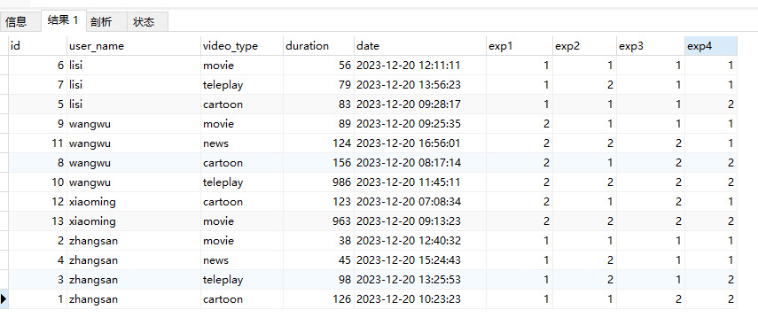

# 窗口函数

## 1.前言

又到了年底，最近在做年报数据拉取的需求，在这期间有一些数据的计算需要用到窗口函数，就去了解了一下常用的窗口函数的用法。

### 1.1.什么是窗口函数

窗口函数是 SQL 中的一种特殊函数，它允许你在查询结果中的某个窗口或窗口范围上执行计算，而不是单独针对整个结果集进行计算。

窗口函数通常与 `OVER()` 子句结合使用，用于定义窗口的范围。这个范围可以是整个结果集、分组的行、特定的物理行数范围，或者是基于值范围的窗口。

窗口函数通常在查询的最后阶段执行，即在结果集形成之后对结果集中的行应用窗口函数。窗口函数计算的结果是基于最终结果集的行，而不影响原始数据的分组，也就是说窗口函数的结果会添加到原查询结果的每一行上，这是个人觉得这是`OVEE(PARTITION BY COLUMN_NAME ORDER BY COLUMN_NAME)` 与 传统的 `GROUP BY COLUMN ORDER BY COLUMN` 差别最大的地方。

## 2.常用窗口函数

可以使用以下sql进行初始化

```sql
CREATE TABLE `video_play` (
  `id` int NOT NULL AUTO_INCREMENT,
  `user_name` varchar(255) CHARACTER SET utf8 COLLATE utf8_general_ci DEFAULT NULL COMMENT '用户名',
  `video_type` varchar(255) CHARACTER SET utf8 COLLATE utf8_general_ci DEFAULT NULL COMMENT '视频类型',
  `duration` int DEFAULT NULL COMMENT '播放时间',
  `date` datetime DEFAULT NULL COMMENT '开始播放时间',
  PRIMARY KEY (`id`)
);

INSERT INTO `video_play` (`id`, `user_name`, `video_type`, `duration`, `date`) VALUES (1, 'zhangsan', 'cartoon', 126, '2023-12-20 10:23:23');
INSERT INTO `video_play` (`id`, `user_name`, `video_type`, `duration`, `date`) VALUES (2, 'zhangsan', 'movie', 38, '2023-12-20 12:40:32');
INSERT INTO `video_play` (`id`, `user_name`, `video_type`, `duration`, `date`) VALUES (3, 'zhangsan', 'teleplay', 98, '2023-12-20 13:25:53');
INSERT INTO `video_play` (`id`, `user_name`, `video_type`, `duration`, `date`) VALUES (4, 'zhangsan', 'news', 45, '2023-12-20 15:24:43');
INSERT INTO `video_play` (`id`, `user_name`, `video_type`, `duration`, `date`) VALUES (5, 'lisi', 'cartoon', 83, '2023-12-20 09:28:17');
INSERT INTO `video_play` (`id`, `user_name`, `video_type`, `duration`, `date`) VALUES (6, 'lisi', 'movie', 56, '2023-12-20 12:11:11');
INSERT INTO `video_play` (`id`, `user_name`, `video_type`, `duration`, `date`) VALUES (7, 'lisi', 'teleplay', 79, '2023-12-20 13:56:23');
INSERT INTO `video_play` (`id`, `user_name`, `video_type`, `duration`, `date`) VALUES (8, 'wangwu', 'cartoon', 156, '2023-12-20 08:17:14');
INSERT INTO `video_play` (`id`, `user_name`, `video_type`, `duration`, `date`) VALUES (9, 'wangwu', 'movie', 89, '2023-12-20 09:25:35');
INSERT INTO `video_play` (`id`, `user_name`, `video_type`, `duration`, `date`) VALUES (10, 'wangwu', 'teleplay', 986, '2023-12-20 11:45:11');
INSERT INTO `video_play` (`id`, `user_name`, `video_type`, `duration`, `date`) VALUES (11, 'wangwu', 'news', 124, '2023-12-20 16:56:01');
INSERT INTO `video_play` (`id`, `user_name`, `video_type`, `duration`, `date`) VALUES (12, 'xiaoming', 'cartoon', 123, '2023-12-20 07:08:34');
INSERT INTO `video_play` (`id`, `user_name`, `video_type`, `duration`, `date`) VALUES (13, 'xiaoming', 'movie', 963, '2023-12-20 09:13:23');
```


### 2.1.SUM()

用法：`SUM(COLUMN_NAME) OVER([PARTITION BY COLUMN_NAME] [ORDER BY COLUMN_NAME]);`

如果存在PARTITION BY COLUMN_NAME, 则代表查询结果根据COLUMN_NAME进行分组求和。

如果存在ORDER BY COLUMN_NAME, 则代表查询结果则根据COLUMN_NAME排序后, 按照排序的结果进行**累积求和**。这里的累积求和是指在当前窗口内，当前行的值加上前行的值得到的结果。如果不加ORDER BY同一窗口内每一行的值都相同，为当前窗口内所有值的和。

sql举例：

```sql
SELECT 
	*, 
	SUM(duration) OVER() AS exp1, 
	SUM(duration) OVER(PARTITION BY user_name) AS exp2, 
	SUM(duration) OVER(ORDER BY `date` ASC) AS exp3, 
	SUM(duration) OVER(PARTITION BY user_name ORDER BY `date` ASC) AS exp4 
FROM 
	video_play;
```


### 2.2.COUNT()

用法：`COUNT([DISTINCT] COLUMN_NAME) OVER([PARTITION BY COLUMN_NAME] [ORDER BY COLUMN_NAME])`

整体用法跟SUM()函数类似，只是由求和变成了计数，并且支持DISTINCT去重，目前已知的是Mysql不支持。

sql举例：

```sql
SELECT 
	*, 
	COUNT(duration) OVER() AS exp1, 
	COUNT(duration) OVER(PARTITION BY video_type) AS exp2, 
	COUNT(duration) OVER(ORDER BY duration) AS exp3, 
	COUNT(duration) OVER(PARTITION BY video_type ORDER BY duration ASC) AS exp4 
FROM 
	video_play;
```


### 2.3.AVG()

用法：`AVG(COLUMN_NAME) OVER([PARTITION BY COLUMN_NAME] [ORDER BY COLUMN_NAME]);`

整体用法跟SUM()函数类似，只是由求和变成了求平均值。

sql举例：

```sql
SELECT 
	*, 
	AVG(duration) OVER() AS exp1, 
	AVG(duration) OVER(PARTITION BY user_name) AS exp2, 
	AVG(duration) OVER(ORDER BY `date` ASC) AS exp3, 
	AVG(duration) OVER(PARTITION BY user_name ORDER BY `date` ASC) AS exp4 
FROM 
	video_play;
```


### 2.4.ROW_NUMBER()

用法：`ROW_NUMBER() OVER([PARTITION BY COLUMN_NAME] [ORDER BY COLUMN_NAME])`

这个函数的功能是求结果的行号, 可以使用ORDER BY 进行内部排序之后再去求行号, 行号是连续的不会出现空缺

sql举例：

```sql
SELECT 
	*, 
	ROW_NUMBER() OVER() AS exp1, 
	ROW_NUMBER() OVER(PARTITION BY user_name) AS exp2, 
	ROW_NUMBER() OVER(ORDER BY `date` ASC) AS exp3, 
	ROW_NUMBER() OVER(PARTITION BY user_name ORDER BY `date` ASC) AS exp4 
FROM 
	video_play;
```


这个函数是这次年报中用的比较多的函数，简化版的需求就是求每个用户播放时长TOPN的类型及播放时间。实现思路是现根据用户分组，再使用该函数对时长进行排序并生成行号，最后取每个用户的前N行数据，下面是实现的sql及结果

```sql
WITH user_video_play_index AS (
	SELECT
		user_name,
		video_type,
		duration,
		ROW_NUMBER() OVER(PARTITION BY user_name ORDER BY duration DESC, date ASC) AS row_num
	FROM 
		video_play
)
	
SELECT 
	user_name,
	video_type,
	duration,
	row_num
FROM
	user_video_play_index
WHERE
	row_num <= 2
```


### 2.5.RANK()和DENSE_RANK()

用法：`RANK()/DENSE_RANK() OVER([PARTITION BY COLUMN_NAME] [ORDER BY COLUMN_NAME])`

这个函数的功能是求排名, 如果不使用ORDER BY指明要排序的列, 值会固定为1。如果排序之后的值相同, RANK值也会相同, 如果是RANK()函数，后面的值会跳过相同数量的间隔，DENSE_RANK()则不会（这次的数据集中的值没有相同的，没办法体现出来这一点）。

sql举例

```sql
SELECT 
	*, 
	RANK() OVER() AS exp1, 
	RANK() OVER(PARTITION BY user_name) AS exp2, 
	RANK() OVER(ORDER BY duration ASC) AS exp3, 
	RANK() OVER(PARTITION BY user_name ORDER BY duration ASC) AS exp4,
	DENSE_RANK() OVER() AS exp5, 
	DENSE_RANK() OVER(PARTITION BY user_name) AS exp6, 
	DENSE_RANK() OVER(ORDER BY duration ASC) AS exp7, 
	DENSE_RANK() OVER(PARTITION BY user_name ORDER BY duration ASC) AS exp8
FROM 
	video_play
```


### 2.6.FIRST_VALUE()和LAST_VALUE()

用法：`FIRST_VALUE(COLUMN_NAME)/LAST_VALUE(COLUMN_NAME) OVER([PARTITION BY COLUMN_NAME] [ORDER BY COLUMN_NAME]);`

这两个函数是用来求分组和排序之后的第一个值和最后一个值, LAST_VALUE会随着窗口大小的增加而变化, 所以如果进行排序一般是当前行的值。

sql举例：

```sql
SELECT 
	*, 
	FIRST_VALUE(duration) OVER() AS exp1, 
	FIRST_VALUE(duration) OVER(PARTITION BY user_name) AS exp2, 
	FIRST_VALUE(duration) OVER(ORDER BY duration ASC) AS exp3, 
	FIRST_VALUE(duration) OVER(PARTITION BY user_name ORDER BY duration ASC) AS exp4,
	LAST_VALUE(duration) OVER() AS exp5,
	LAST_VALUE(duration) OVER(PARTITION BY user_name) AS exp6, 
	LAST_VALUE(duration) OVER(ORDER BY duration ASC) AS exp7, 
	LAST_VALUE(duration) OVER(PARTITION BY user_name ORDER BY duration ASC) AS exp8 
FROM 
	video_play
```


### 2.7.LAG()和LEAD()

用法：`LAG(COLUMN_NAME, MOVE_LINE_NUM, DEFAULT_VALUE)/LEAD(COLUMN_NAME, MOVE_LINE_NUM, DEFAULT_VALUE) OVER([PARTITION BY COLUMN_NAME] [ORDER BY COLUMN_NAME]);`

LAG和LEAD是分别用来向前或向后取值的函数; 函数里面三个参数含义是从当前行向前或向后推`MOVE_LINE_NUM`行, 然后去取该行的`COLUMN_NAME`字段, 如果向前或向后移动失败(一般是超过窗口的头部或超过窗口的尾部)则去取`DEFAULT_VALUE`的值。

sql举例：

```sql
SELECT 
	*, 
	LAG(duration, 2, 0) OVER() AS exp1, 
	LAG(duration, 2, 0) OVER(PARTITION BY user_name) AS exp2, 
	LAG(duration, 2, 0) OVER(ORDER BY duration ASC) AS exp3, 
	LAG(duration, 2, 0) OVER(PARTITION BY user_name ORDER BY duration ASC) AS exp4,
	LEAD(duration, 2, 0) OVER() AS exp5,
	LEAD(duration, 2, 0) OVER(PARTITION BY user_name) AS exp6, 
	LEAD(duration, 2, 0) OVER(ORDER BY duration ASC) AS exp7, 
	LEAD(duration, 2, 0) OVER(PARTITION BY user_name ORDER BY duration ASC) AS exp8 
FROM 
	video_play
```


### 2.8.NTILE()

用法：`NTILE(PART_NUM) OVER([PARTITION BY COLUMN_NAME] [ORDER BY COLUMN_NAME]);`

NTILE函数是用来对数据进行分组的, 它会**尽可能的把数据平均分**为PART_NUM组，结果为当前行的组号。如果遇到无法均分的情况，mysql的逻辑时后面的组会比前面的组少1行数据，其他的数据库暂时没有测试。

sql举例：

```sql
SELECT 
	*, 
	NTILE(2) OVER() AS exp1, 
	NTILE(2) OVER(PARTITION BY user_name) AS exp2, 
	NTILE(2) OVER(ORDER BY duration ASC) AS exp3, 
	NTILE(2) OVER(PARTITION BY user_name ORDER BY duration ASC) AS exp4
FROM 
	video_play
```




## 3.others

当使用窗口函数时，`ROWS`、`RANGE` 和 `GROUPS` 是用于定义窗口框架的不同方式，它们用于指定窗口函数操作中所考虑的数据范围。

- ROWS

  - ```sql
    SELECT
        id,
        value,
        SUM(value) OVER (ORDER BY id ROWS BETWEEN 1 PRECEDING AND 1 FOLLOWING) AS sum_values
    FROM
        your_table;
    ```

  - 在这个例子中，`ROWS BETWEEN 1 PRECEDING AND 1 FOLLOWING` 指定了窗口函数 `SUM()` 的范围，在当前行的前一行到后一行（共三行）的范围内计算 `value` 的总和。

  - `ROWS` 是基于物理行数来定义窗口范围，独立于分组逻辑。

- RANGE

  - ```sql
    SELECT
        date_column,
        value,
        SUM(value) OVER (ORDER BY date_column RANGE BETWEEN INTERVAL 7 DAY PRECEDING AND INTERVAL 3 DAY FOLLOWING) AS sum_values
    FROM
        your_table;
    ```

  - 在这个例子中，`RANGE BETWEEN INTERVAL 7 DAY PRECEDING AND INTERVAL 3 DAY FOLLOWING` 指定了窗口函数 `SUM()` 的范围，以当前行日期为中心，计算前七天到后三天内的 `value` 总和。

- GROUPS

  - ```sql
    SELECT
        id,
        value,
        SUM(value) OVER (PARTITION BY category ORDER BY id GROUPS BETWEEN 1 PRECEDING AND 1 FOLLOWING) AS sum_values
    FROM
        your_table;
    ```

  - 在这个例子中，`GROUPS BETWEEN 1 PRECEDING AND 1 FOLLOWING` 指定了窗口函数 `SUM()` 的范围，以当前行所属的 `category` 分组为基础，在每个分组内的前一行到后一行的范围内计算 `value` 的总和。

    这些不同的窗口框架定义方式允许在窗口函数中灵活地选择不同的数据范围进行计算和分析。

  - `GROUPS` 根据分组条件定义窗口范围，对应于分组的逻辑；


